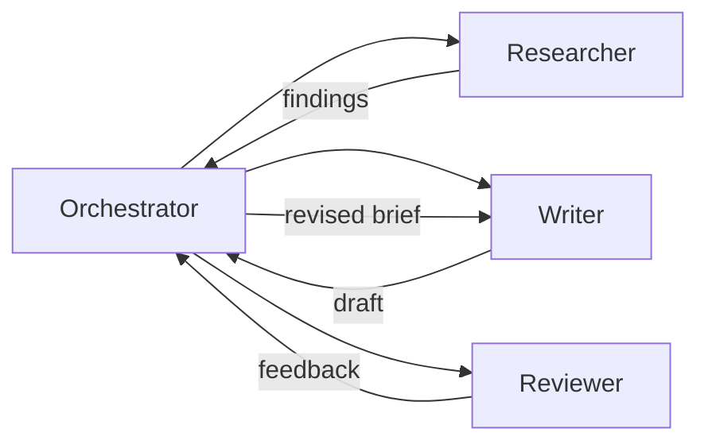

# §15. Orchestrating multiple Hermes agents

A single Hermes instance with good tools can handle most tasks well. But some problems are fundamentally better suited to a team of specialized agents: tasks where parallelism matters, where different roles require different context and constraints, or where an independent review step is worth the overhead.

This chapter explains when multi-agent orchestration makes sense, how to set it up, and how to avoid the pitfalls.

## What is multi-agent orchestration?

Multi-agent orchestration means running multiple Hermes instances — each with its own role, context, and constraints — and coordinating their outputs to complete a larger task. One agent might gather information while another analyzes it; one might write while another reviews; one might plan while another executes.

The key difference from tool use is that each agent maintains its own working context and can reason independently. The orchestrator (which may itself be a Hermes instance) manages the flow: deciding which agent runs when, what each agent receives as input, and how outputs are combined or handed off.

## Why use multiple agents

### Parallelism

Some tasks decompose into independent subtasks that can run concurrently. Researching three competing products, generating test cases for multiple modules, or translating a document into several languages simultaneously — these are faster with parallel agents than with a single agent working sequentially.

### Specialized roles

Different stages of a workflow benefit from different context and constraints. A research agent should be exploratory and thorough; a writing agent should be focused and concise; a review agent should be skeptical and precise. Maintaining separate agents prevents these modes from bleeding into each other.

### Separation of concerns

Keeping agents separated by role makes the pipeline easier to debug, modify, and improve. If the quality of your final output is low, you can identify which stage introduced the problem and adjust that agent's configuration without touching the others.

### Independent review

Having a separate agent review the output of another agent provides a form of quality control that self-review can't replicate. The reviewing agent has no attachment to the decisions made in production and can evaluate them more objectively.

## How Hermes coordinates with other Hermes instances

Hermes supports inter-agent communication through a shared message-passing interface. The orchestrator agent sends structured messages to worker agents, receives their outputs, and decides what to do next.

Each agent instance maintains its own memory scope by default. The orchestrator can optionally grant worker agents read access to specific memory segments — for example, allowing a writing agent to read the research agent's episodic memory for a project without merging their long-term memories.

**Agent roles in a pipeline:**



The orchestrator dispatches tasks, collects results, handles errors (retries, alternative approaches), and delivers the final output. Worker agents are stateless with respect to the pipeline — they receive a task, complete it, and return output.

## Example: a researcher, writer, and reviewer team

A three-agent pipeline for producing a well-researched technical article:

**Researcher agent**: configured to be thorough and source-oriented, with broad tool access (web search, document retrieval, knowledge base access). Its job is to gather evidence, identify key claims, and flag gaps in the available material.

**Writer agent**: configured with the author's style Skill and constrained to the material provided by the researcher. It does not browse independently — this prevents the draft from drifting away from the researched sources.

**Reviewer agent**: configured to be skeptical. It evaluates the draft against factual accuracy (cross-checking claims against the researcher's sources), logical consistency, and style guidelines. It returns structured feedback, not a revised draft.

The orchestrator runs researcher → writer → reviewer, then optionally runs writer again with the reviewer's feedback for a final pass.

## Inter-agent memory and Skill sharing

By default, each agent maintains an isolated memory scope. This is the right default: it prevents contamination between roles and keeps each agent's behavior predictable.

For longer-running projects, you may want to enable selective memory sharing:

- **Read-only access**: the writer agent can read the researcher's findings from episodic memory, but cannot write to it
- **Shared project memory**: a named memory segment that all agents in a pipeline can read and write — useful for project-level facts that every agent needs (the audience, the constraints, the goal)
- **Skill inheritance**: a worker agent can be initialized with a parent Skill and then diverge — useful when you want a variant of your default writing Skill that's more formal for a specific context

Skills can be shared between agents explicitly. If your researcher agent develops a strong Skill for evaluating technical sources, you can export and import it to other researcher instances without requiring them to redevelop it from experience.

## Setting up an agent pipeline

<Steps>
  <Step title="Define the task and decomposition">
    Start by clearly specifying the overall goal and how it breaks into subtasks. Write this as a pipeline definition: each stage, its inputs, its outputs, and its success criteria.

    ```text
    Task: produce a 2000-word technical overview of WebAssembly for our developer blog.

    Pipeline:
    1. Research: gather 8-10 high-quality sources, extract key claims, identify gaps
    2. Outline: generate a structured outline from research findings
    3. Draft: write full article from outline and sources
    4. Review: evaluate draft for accuracy, completeness, and style
    5. Revise: incorporate review feedback into final draft
    ```
  </Step>
  <Step title="Configure each agent's role and constraints">
    For each agent, define its system context, the tools it has access to, and the constraints it operates under. Be explicit about what each agent should *not* do — this is as important as what it should do.

    ```text Researcher agent configuration
    Role: technical researcher
    Goal: gather and synthesize source material for a blog post on WebAssembly
    Tools: web search, document retrieval, knowledge base read access
    Constraints:
    - Return structured output: source URL, key claims, credibility assessment
    - Flag claims that appear in only one source
    - Do not write narrative prose — return structured findings only
    - Maximum 10 sources; prefer recent (2024+) and authoritative
    ```

    ```text Writer agent configuration
    Role: technical writer
    Goal: write a draft article using only the provided research material
    Tools: none (no independent web access)
    Style Skill: [author's writing Skill]
    Constraints:
    - Do not introduce claims not present in the research material
    - Flag with [NEEDS SOURCE] any claim you want to include that wasn't in the research
    - Target: 2000 words, technical but accessible to senior engineers
    ```
  </Step>
  <Step title="Set up handoff schemas">
    Define the format for outputs at each handoff point. Structured outputs (JSON, Markdown with frontmatter) are more reliable than unstructured prose when passing between agents.

    ```json Research agent output schema
    {
      "sources": [
        {
          "url": "string",
          "title": "string",
          "key_claims": ["string"],
          "credibility": "high | medium | low",
          "recency": "YYYY-MM"
        }
      ],
      "key_themes": ["string"],
      "gaps": ["string"],
      "suggested_outline_points": ["string"]
    }
    ```
  </Step>
  <Step title="Configure the orchestrator">
    The orchestrator needs to understand the full pipeline, handle agent failures, and make decisions about when to retry vs. proceed vs. abort.

    ```text Orchestrator configuration
    Manage a three-stage content pipeline: research → write → review.
    
    On research completion: validate that at least 6 sources were found and
    key_themes is non-empty before proceeding. If not, retry research with
    a broader search scope.
    
    On draft completion: route to reviewer immediately. Do not show draft
    to user unless reviewer flags a structural problem requiring human input.
    
    On review completion: if reviewer confidence is high (>0.8), apply
    feedback automatically and deliver final draft. If confidence is low,
    surface review feedback to user for a decision.
    ```
  </Step>
  <Step title="Run and monitor the pipeline">
    Start the pipeline and monitor progress. The orchestrator exposes a status log showing which agent is active, what it's working on, and any errors encountered.

    For long-running pipelines, you can checkpoint between stages — saving the output of each stage so that a failure midway doesn't require restarting from scratch.
  </Step>
  <Step title="Evaluate and refine">
    After the pipeline completes, evaluate the output quality by stage. Which stage introduced errors? Where did quality degrade? This analysis informs adjustments to individual agent configurations without requiring changes to the full pipeline.
  </Step>
</Steps>

## Monitoring and debugging multi-agent workflows

Multi-agent workflows fail in characteristic ways:

- **Context drift**: a writer agent ignores the researcher's findings and draws on its own general knowledge
- **Circular loops**: the reviewer and writer enter a revision cycle without converging
- **Schema mismatch**: an agent returns output in a format the next stage can't parse
- **Scope creep**: an agent expands its task beyond its defined role, producing outputs that confuse downstream agents

The Hermes agent dashboard (available in the web interface) provides per-agent traces for debugging. Each agent's input, reasoning steps, and output are logged separately, making it straightforward to identify which stage produced a problem.

<Warning>
  Multi-agent pipelines are harder to debug than single-agent workflows. Before building a complex pipeline, confirm that a single agent with well-designed tool access cannot accomplish the same goal. The orchestration overhead — in latency, cost, and debugging complexity — is only worth it when parallelism or role separation provides a clear benefit.
</Warning>

## Multi-agent patterns

<CardGroup cols={2}>
  <Card title="Map-reduce" icon="arrows-split-up-and-left">
    Split a large task into independent parallel subtasks (map), then aggregate the results (reduce). Useful for processing large document sets, multi-source research, or generating content at scale.
  </Card>
  <Card title="Critic-refiner" icon="comment">
    One agent produces output; a separate critic agent evaluates it; the original agent revises based on the critique. Iterate until the critic's confidence score crosses a threshold.
  </Card>
  <Card title="Role-based pipeline" icon="users">
    Sequential pipeline with distinct roles: researcher → planner → executor → reviewer. Each agent hands off structured output to the next stage. Best for complex, multi-step tasks where role separation improves quality.
  </Card>
  <Card title="Specialist pool" icon="grid">
    A routing orchestrator dispatches subtasks to specialized agents based on task type — a code agent for code tasks, a research agent for information gathering, a writing agent for content. Each specialist runs independently.
  </Card>
</CardGroup>

## When to use multi-agent vs. single agent with tools

Multi-agent orchestration adds complexity. Use it when the benefits are concrete:

| Scenario | Recommendation |
|---|---|
| Task parallelism that would take significantly longer sequentially | Multi-agent |
| Independent review step is critical to output quality | Multi-agent (critic pattern) |
| Task decomposes cleanly into isolated roles with different context needs | Multi-agent |
| Single complex task with multiple tool calls | Single agent with tools |
| Task requires tight reasoning across all sub-steps | Single agent — context fragmentation hurts |
| Latency is critical and pipeline overhead is unacceptable | Single agent |
| Debugging simplicity matters more than quality gains | Single agent |

The rule of thumb: if you can describe the task as a single coherent role with a clear goal, use one agent. If the task genuinely requires switching between modes that would interfere with each other, or if parallelism provides a meaningful speedup, reach for multi-agent orchestration.
